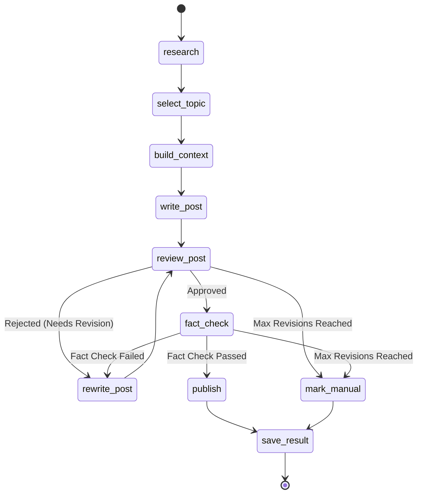

# LinkedIn Agent: System Design & Architecture

## Overview
The **LinkedIn Agent** is an autonomous pipeline built using [LangGraph](https://python.langchain.com/docs/langgraph/). Its goal is to research topics, select a suitable candidate, gather context, write a post, review it (with a rewrite loop if necessary), fact-check it, and finally publish it to LinkedIn. 

Currently, the project is in **Phase 1** (Scaffold), which implements the end-to-end graph, database setup, type definitions, state routing (with revision limits), and stub (dummy) agents. This decoupled architecture allows swapping out stub agents with real LLM implementations (e.g., Gemini, Laya) in future phases without altering the underlying graph orchestration.

---

## Core Architecture

The architecture enforces a strict separation of concerns:
1. **Workflow (Orchestration):** LangGraph defines the state machine (`app/graph/workflow.py`). It orchestrates *when* agents run and handles conditional routing based on their output.
2. **State Management:** A strongly-typed dictionary (`ContentState` in `app/graph/state.py`) flows through the nodes. It stores intermediate results, texts, scores, and flags.
3. **Agent Interfaces:** Defined as Python `Protocol` classes (`app/agents/base.py`). The workflow depends *only* on these protocols. This means you can replace a stub agent with an advanced LLM implementation seamlessly.

---

## Workflow Diagram

The LangGraph pipeline follows a state machine with a review-rewrite loop:

### Node Explanations:
1. **`research`**: Discovers candidate topics based on a target date and previous topics (via `MemoryStore`).
2. **`select_topic`**: Uses the `TopicSelector` to choose the most engaging/relevant topic from the candidates.
3. **`build_context`**: Uses the `Researcher` to perform a "deep dive" on the selected topic (fetching facts, sources, summary) and loads personal context/previous posts.
4. **`write_post`**: Drafts the initial LinkedIn post.
5. **`review_post`**: Uses the `PostRater` to evaluate the draft against multiple metrics (human naturalness, personal voice, originality, generic AI language). Determines whether the post is approved or needs rewriting.
6. **`rewrite_post`**: Revises the post based on the feedback from the `PostRater`. This loops back to `review_post`. If `max_revisions` is exceeded, the post is aborted and sent to `mark_manual`.
7. **`fact_check`**: Verifies the final approved draft against the collected research sources to ensure no hallucination or unsupported claims.
8. **`publish`**: Publishes the final content to LinkedIn. By default, `DRY_RUN=true` and `AUTO_PUBLISH=false` prevents actual external API calls.
9. **`save_result`**: Persists the run's state and generated content to the database via `Repository`.
10. **`mark_manual`**: A terminal state for runs that exhausted their revision limit without passing quality or fact checks. These are saved as drafts but never published.

---

## State Management (`ContentState`)

The state flows between all nodes in LangGraph. Key fields include:

- **Inputs**: `run_id`, `target_date`, `max_revisions`
- **Topics**: `candidate_topics`, `selected_topic`, `rejected_topics`
- **Context**: `research_results`, `research_sources`, `personal_context`
- **Content Generation**: `draft_post`, `revised_post`, `final_post`
- **Evaluation**: `review_result`, `fact_check_result`, `revision_count`
- **Status Flags**: `approved`, `fact_checked`, `published`, `status`, `errors`

---

## Agent Interfaces (Protocols)

The agents are abstracted into standard protocols. Future implementations (e.g., using Gemini API) will fulfill these contracts:

*   **`Researcher`**: `discover()` to find topics, `deep_research()` to gather facts and sources.
*   **`TopicSelector`**: `select()` to pick the best topic from a list.
*   **`MemoryStore`**: Retrieves `previous_topics()`, `personal_context()`, and `previous_posts()`.
*   **`Writer` & `Rewriter`**: Generates and revises the post content based on state instructions.
*   **`PostRater`**: Uses structured output (`PostRating`) to score human naturalness, generic AI language (lower is better), specificity, readability, and likelihood of fabricated claims. 
*   **`FactChecker`**: Validates claims in the post against sources (`FactCheckResult`).
*   **`Publisher`**: Interfaces with the LinkedIn API to post content.
*   **`Repository`**: Handles database I/O for saving the pipeline results.

---

## Development Roadmap & Phases

Based on the project's strategy (`CLAUDE.md`), the rollout is staged:

*   **Phase 1 (Completed)**: Scaffold, config, DB migrations, typed state, routing, and stub agents.
*   **Phase 2**: Implement `Gemini` API for research, topic selection, and writing.
*   **Phase 3**: Implement `Laya` (convaiinnovations/laya) for topic scoring and post "humanness" rating, plus the rewrite loop.
*   **Phase 4**: Implement fact-checking, duplicate detection, and memory.
*   **Phase 5**: LinkedIn OAuth and Publisher integration.
*   **Phase 6**: Task scheduler, FastAPI endpoints, logging.
*   **Phase 7**: End-to-end tests and deployment.

### Safety First Principles
*   **Never Publish by Default:** Publishing is guarded by configuration (`DRY_RUN=false` and `AUTO_PUBLISH=true`), and checks (`approved` + `fact_checked`).
*   **Fail Gracefully:** Graph catches exceptions, logs them, and safely transitions to a `manual_review_required` state without crashing or publishing broken content.
